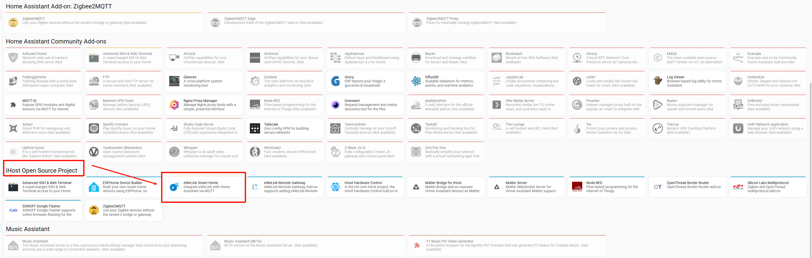
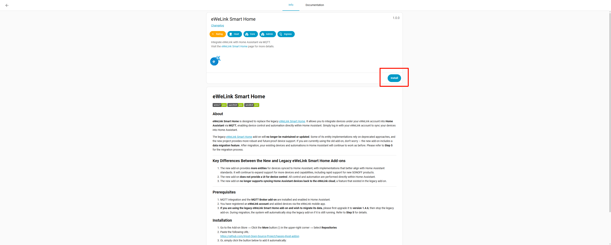
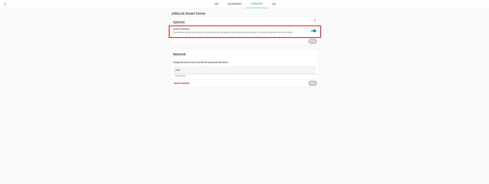
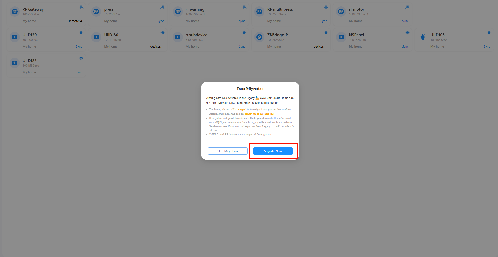
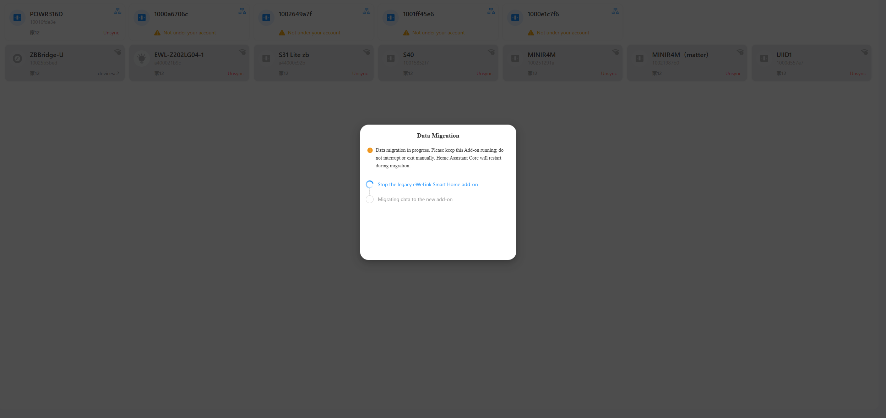
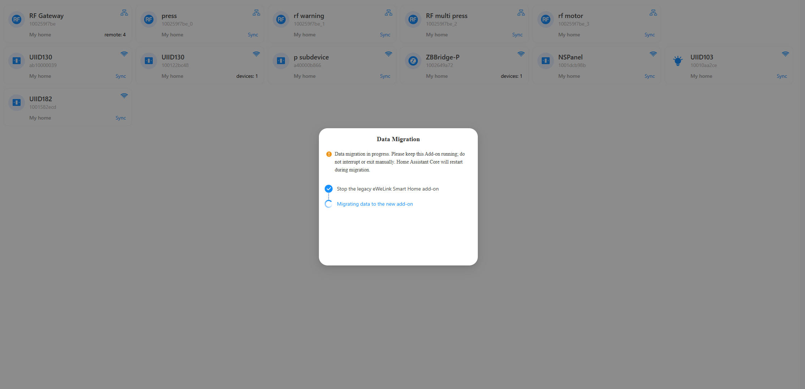
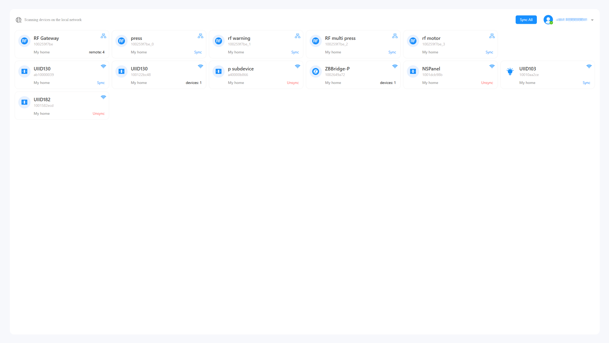
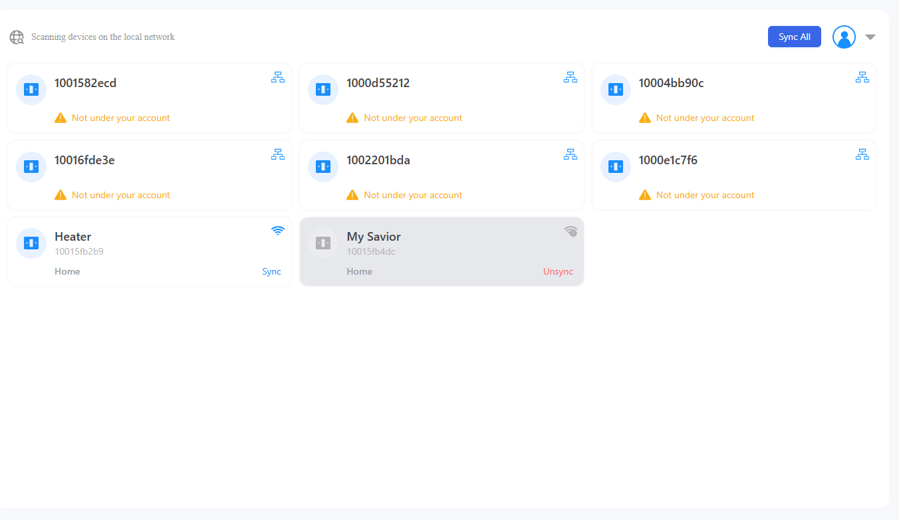

# eWeLink Smart Home

## 1. Introduction

**eWeLink Smart Home** is designed to replace the legacy [eWeLink Smart Home](https://github.com/CoolKit-Technologies/ha-addon). It allows you to integrate devices under your eWeLink account into **Home Assistant** via **MQTT**, enabling device control and automation directly within Home Assistant. Simply log in with your eWeLink account to sync your devices into Home Assistant.

The legacy [eWeLink Smart Home](https://github.com/CoolKit-Technologies/ha-addon) add-on will **no longer be maintained or updated**. Some of its entity implementations rely on deprecated approaches, and the new project provides more robust and future-proof device support.
If you are currently using the old add-on, don’t worry — the new add-on includes a **data migration feature**. After migration, your existing devices and automations in Home Assistant will continue to work as before. Please refer to **Step 5** for the migration process.

---

## 2. Key Differences Between the New and Legacy eWeLink Smart Home Add-ons

1. The new add-on provides **more entities** for devices synced to Home Assistant, with implementations that better align with Home Assistant standards. It will continue to expand support for more devices and capabilities, including rapid support for new SONOFF products.
2. The new add-on **does not provide a UI for device control**. All control and automation are performed directly within Home Assistant.
3. The new add-on **no longer supports syncing Home Assistant devices back to the eWeLink cloud**, a feature that existed in the legacy add-on.

---

## 3. Prerequisites

1. MQTT integration and the **MQTT Broker add-on** are installed and enabled in Home Assistant.
2. You have registered an **eWeLink account** and added devices via the eWeLink mobile app.
3. **If you are using the legacy eWeLink Smart Home add-on and wish to migrate its data**, please first upgrade it to **version 1.4.6**, then stop the legacy add-on. During migration, the system will automatically stop the legacy add-on if it is still running. Refer to **Step 5** for details.

---

## 4. Installing the eWeLink Smart Home Add-on

### 4.1 Add the Repository

Skip this step and simply proceed to the Add-on Store to install the required add-on if you have already added the add-ons from this repository (e.g., iHost Hardware Control).

1. Via URL

-   Navigate to Settings > Add-on Store> Click the three-dot menu (⋮) in the top right corner and select Repositories
-   Enter the repository URL into the input box: https://github.com/iHost-Open-Source-Project/hassio-ihost-addon

2. Via Button Clicking

-   Click this button to add the add-on automatically
    

---

### 4.2 Install the Add-on

1. Search for **eWeLink Smart Home** in the Add-on Store
   
2. Click **Install**
   
3. Wait for the installation to complete

---

### 4.3 Start the Add-on

After installation, click **Start** to launch the add-on. Please wait until the service has fully started before continuing.
_(Screenshot pending)_

---

## 5. Migrating Data From the Legacy eWeLink Smart Home Add-on

> If you do not need to migrate data from the legacy add-on, you may skip this section and proceed to **Step 6**.

### 5.1 **Important**: Upgrade the Legacy Add-on to Version 1.4.6

Return to the legacy eWeLink Smart Home add-on and upgrade it to **version 1.4.6**.

**Conflict Detection**
To prevent data inconsistency, the legacy and new eWeLink Smart Home add-ons **cannot run simultaneously by default**.
After upgrading, you will see a configuration option called **Conflict Detection**, which is enabled by default.

-   If disabled, both add-ons can run at the same time, but data consistency is **not guaranteed**.
-   This configuration is **not recommended**.

---

### 5.2 Log In to the New Add-on

Log in to the new eWeLink Smart Home add-on using the **same eWeLink account** as the legacy add-on.

1. Account login
   
2. QR code login
   

---

### 5.3 Start Data Migration

After logging in, the system will automatically detect whether the same devices exist under both the new and legacy add-ons. If matching devices are found, you will be prompted to migrate data.

You may choose to migrate immediately or defer until the next login.

#### 5.3.1 Start Migration

Click **Migrate Now** to begin.
During migration:

-   Keep Home Assistant and the new add-on running.
-   Do not interrupt or close the process.
-   Home Assistant Core will be restarted once during migration.

#### 5.3.2 Stop the Legacy Add-on

To ensure data integrity, the system will automatically stop the legacy add-on.

If stopping fails (for example, if the legacy add-on is running in a standalone container), manually stop it and then return to the new add-on page and click **Stopped, Continue Migration**.

#### 5.3.3 Migration in Progress

Once the legacy add-on has stopped successfully, data migration will begin automatically.
Home Assistant Core will restart once, typically taking **2–3 minutes**.

#### 5.3.4 Migration Completed

After a successful migration, devices previously added to Home Assistant via the legacy add-on will appear as **synced** in the new add-on.

#### 5.3.5 Cancel Migration

You may cancel migration at any time before it begins. After cancellation, logging out and back in will trigger the migration prompt again.

#### 5.3.6 Unexpected Exit

If you exit the new add-on UI or restart the add-on during migration, the migration process will **continue uninterrupted**.

---

### 5.4 Skip Migration

If you choose not to migrate, devices previously added via the legacy add-on will not be synced.
When syncing devices in the new add-on, **new devices and entities** will be created in Home Assistant.

---

## 6. Syncing Devices to Home Assistant

### 6.1 Log In to Your eWeLink Account

1. Account login
   
2. QR code login
   

---

### 6.2 Device List

1. Devices are divided into **LAN devices** and **cloud devices**, distinguished by the icon in the top-right corner of each device card.
   
2. If a device supports both LAN and cloud control, **LAN control is prioritized**, and the LAN icon will be shown.
3. **Refresh device list**:
    - LAN devices refresh automatically every **30 seconds**
    - Cloud devices require manual refresh via the account menu in the top-right corner
      
4. **Unsupported devices** may appear in the list and will be gradually supported in future releases.

---

### 6.3 Sync Individual Devices

If you choose not to migrate legacy data, or if no legacy data exists, you can sync devices individually by clicking **Sync** on the device card.

## 

### 6.4 Sync All Devices

You may also click **Sync All** in the top-right corner to add all supported devices under your account to Home Assistant.

## 

## 7. Viewing Synced Devices in Home Assistant

Devices synced to Home Assistant can be viewed under the **MQTT integration**.

---

## 8. Logging Out of the eWeLink Account

You can log out from the add-on UI via the account menu in the top-right corner.
After logging out:

-   Cloud devices will become unavailable in Home Assistant
-   LAN devices will remain controllable unless you switch accounts

---

## 9. Switching eWeLink Accounts

If you switch to a different eWeLink account, **all devices synced to Home Assistant will become unavailable**.

---

## 10. Supported Devices

The supported device list is as follows:

### Plug

#### Single-channel plug

| Device Protocol | Model                                                                                                                                                                                                                                | Access Method                                                                                                                                                   | Synchronization Capability to HA                                   |
| --------------- | ------------------------------------------------------------------------------------------------------------------------------------------------------------------------------------------------------------------------------------ | --------------------------------------------------------------------------------------------------------------------------------------------------------------- | ------------------------------------------------------------------ |
| Wi-Fi           | BASIC BASICR2 BASICR3 RFR2 MINIR2 RE5V1C S26 Series S55 Series S31 Lite                                                                                                                                      | LAN&Cloud                                                                                                                                                       | Switch Network indicator Power-on behavior RSSI           |
| Wi-Fi           | pow PSF-P76-R3(6)                                                                                                                                                                                                                 | Cloud                                                                                                                                                           | Switch Power  Network indicator Power-on behavior RSSI |
| Wi-Fi           | Micro                                                                                                                                                                                                                                | LAN&Cloud                                                                                                                                                       | Switch Network indicator Power-on behavior RSSI           |
| Wi-Fi           | AM430E-SW1 AM430EV5-B01-GL                                                                                                                                                                                                        | Cloud                                                                                                                                                           | Switch Network indicator Power-on behavior RSSI           |
| Wi-Fi           | CKA-DM4-GL(SW1C-MW)                                                                                                                                                                                                                  | Cloud                                                                                                                                                           | Switch Network indicator Power-on behavior RSSI           |
| Wi-Fi           | BASICR4 MINIR4 MINIR4M S40TPB Lite S40TPA Lite CK-BL602-4SW-HS(138) BL1-S04-01(138) CK-BL602-4SW-HS(138) SN-BL602-S40-01(138) CK-BL602-4SW-AY(138) SN-ESP32D0-MINIR4-01(138) CK-ESP32C3-SW-MT2(138) | LAN&Cloud                                                                                                                                                       | Switch Network indicator Power-on behavior RSSI           |
| Zigbee          | S26R2ZB S31 Lite zb BASICZBR3 TRETAKT plug smart (IKEA) E2204 (IKEA)                                                                                                                                                     | LAN or Cloud  (Devices under ZBBridge-P are controlled over the local area network (LAN)),  while devices under ZBBridge-U are controlled via the cloud.) | Switch RSSI                                                     |

#### Multi-channel plug

| Device Protocol | Model                                                                      | Access Method | Synchronization Capability to HA             |
| --------------- | -------------------------------------------------------------------------- | ------------- | -------------------------------------------- |
| Wi-Fi           | SONOFF DualR2                                                              | LAN&Cloud     | Channel control Network indicator RSSI |
| Wi-Fi           | PSF-B03-GL CKAM3                                                        | LAN&Cloud     | Channel control Network indicator RSSI |
| Wi-Fi           | SONOFF 4CHR3 SONOFF 4CHPROR3                                            | LAN&Cloud     | Channel control Network indicator RSSI |
| Wi-Fi           | CKA-DM4-GL(SW2C-MW)                                                        | Cloud         | Channel control Network indicator RSSI |
| Wi-Fi           | CKA-DM4-GL(SW3C-MW)                                                        | Cloud         | Channel control Network indicator RSSI |
| Wi-Fi           | BL1-S04-01  CK-BL602-4SW-TYSTD CK-BL602-4SW-HS CK-BL602-4SW-HS-03 | LAN&Cloud     | Channel control Network indicator RSSI |

### Switch

#### Single-channel switch

| Device Protocol | Model                                                                                              | Access Method                                                                                                                                                   | Synchronization Capability to HA                                                    |
| --------------- | -------------------------------------------------------------------------------------------------- | --------------------------------------------------------------------------------------------------------------------------------------------------------------- | ----------------------------------------------------------------------------------- |
| Wi-Fi           | TX1C                                                                                               | LAN&Cloud                                                                                                                                                       | Switch Network indicator Power-on behavior RSSI                            |
| Wi-Fi           | SV                                                                                                 | LAN&Cloud                                                                                                                                                       | Switch Network indicator Power-on behavior RSSI                            |
| Wi-Fi           | PSA-BHA-GL(15)                                                                                     | LAN&Cloud                                                                                                                                                       | Switch Temperature Humidity Network indicator Power-on behavior RSSI |
| Wi-Fi           | THR316  THR316D  THR320  THR320D                                                          | LAN&Cloud                                                                                                                                                       | Switch Temperature Humidity Network indicator Power-on behavior RSSI |
| Wi-Fi           | M5-1C  M5-1C-80W  M5-1C-86W  M5-1C-120W ESP32D0-MSW-T5(160) SN-ESP32D0-M5HK-01(160) | LAN&Cloud                                                                                                                                                       | Switch Network indicator Power-on behavior RSSI                            |
| Zigbee          | ZBMINI ZB-SW01 SWITCH-ZED01 SWITCH-ZR02                                                   | LAN or Cloud  (Devices under ZBBridge-P are controlled over the local area network (LAN)),  while devices under ZBBridge-U are controlled via the cloud.) | Switch RSSI                                                                      |
| Zigbee          | ZBMINI-L ZBMINIL2                                                                               | LAN or Cloud  (Devices under ZBBridge-P are controlled over the local area network (LAN)),  while devices under ZBBridge-U are controlled via the cloud.) | Switch RSSI                                                                      |

#### Multi-channel switch

| Device Protocol | Model                                                                                              | Access Method                                                                                                                                                  | Synchronization Capability to HA                                                                                                |
| --------------- | -------------------------------------------------------------------------------------------------- | -------------------------------------------------------------------------------------------------------------------------------------------------------------- | ------------------------------------------------------------------------------------------------------------------------------- |
| Wi-Fi           | TX2C CKA-DM4-GL                                                                                 | LAN&Cloud                                                                                                                                                      | Channel control Network indicator RSSI                                                                                    |
| Wi-Fi           | TX3C CKA-DM4-GL(SW3C)                                                                           | LAN&Cloud                                                                                                                                                      | Channel control Network indicator RSSI                                                                                    |
| Wi-Fi           | PSF-B04-GL                                                                                         | LAN&Cloud                                                                                                                                                      | Channel control Network indicator RSSI                                                                                    |
| Wi-Fi           | M5-3C M5-3C-80W M5-3C-86W M5-3C-120W M5-3C-120 SN-ESP32D0-M5HK-01 ESP32D0-MSW-T5 | LAN&Cloud                                                                                                                                                      | Channel control Network indicator RSSI                                                                                    |
| Wi-Fi           | M5-2C M5-2C-80W M5-2C-86W M5-2C-120W                                                      | LAN&Cloud                                                                                                                                                      | Channel control Network indicator RSSI                                                                                    |
| Wi-Fi           | DUALR3                                                                                             | LAN&Cloud                                                                                                                                                      | Switch Curren Voltage Real power Reactive power Apparent power Network indicator Power-on behavior RSSI |
| Zigbee          | ZB-SW02                                                                                            | LAN or Cloud  (Devices under ZBBridge-P are controlled over the local area network (LAN),  while devices under ZBBridge-U are controlled via the cloud.) | Channel control RSSI                                                                                                         |
| Zigbee          | ZB-SW03                                                                                            | LAN or Cloud  (Devices under ZBBridge-P are controlled over the local area network (LAN),  while devices under ZBBridge-U are controlled via the cloud.) | Channel control RSSI                                                                                                         |

### Light

#### Dimming light

| Device Protocol | Model | Access Method | Synchronization Capability to HA                        |
| --------------- | ----- | ------------- | ------------------------------------------------------- |
| Wi-Fi           | D1    | LAN&Cloud     | Light on/off Brightness Power-on behavior RSSI |

#### Color temperature light

| Device Protocol | Model                                                                                                     | Access Method                                                                                                                                                  | Synchronization Capability to HA                        |
| --------------- | --------------------------------------------------------------------------------------------------------- | -------------------------------------------------------------------------------------------------------------------------------------------------------------- | ------------------------------------------------------- |
| Wi-Fi           | B02-F-A19 B02-F-A60 B02-F-ST64 B02-B-A60 ALT-DB2-GL ALT-L2I-GL ALT-L02-GL WTW-705-GL | LAN&Cloud                                                                                                                                                      | Light on/off Brightness Color temperature RSSI |
| Zigbee          | ZB-CT01 EWL-Z102LG01 EWL-Z102LG01-1 EWL-Z202LG01-1 EWL-Z202LG01-2                             | LAN or Cloud  (Devices under ZBBridge-P are controlled over the local area network (LAN),  while devices under ZBBridge-U are controlled via the cloud.) | Light on/off Brightness Color temperature RSSI |

#### Colored lights

| Device Protocol | Model                                                                         | Access Method                                                                                                                                                  | Synchronization Capability to HA                                             |
| --------------- | ----------------------------------------------------------------------------- | -------------------------------------------------------------------------------------------------------------------------------------------------------------- | ---------------------------------------------------------------------------- |
| Wi-Fi           | B1 B1_R2 CKDK-001                                                       | Cloud                                                                                                                                                          | Light on/off Brightness Color temperature Color RGB Mode RSSI |
| Wi-Fi           | L1 PSF-BTA-GL(59)                                                          | Cloud                                                                                                                                                          | Light on/off Brightness Color temperature Color RGB Mode RSSI |
| Wi-Fi           | L2-2M L2-5M L2-C L2 Lite-5M-EU L2 Lite-5M-US L3-5M             | Cloud                                                                                                                                                          | Light on/off Brightness Color temperature Color RGB Mode RSSI |
| Wi-Fi           | B05                                                                           | LAN&Cloud                                                                                                                                                      | Light on/off Brightness Color temperature Color RGB Mode RSSI |
| Wi-Fi           | L3-5M-P                                                                       | Cloud                                                                                                                                                          | Light on/off Brightness Color temperature Color RGB Mode RSSI |
| Zigbee          | ZB-CL01 EWL-Z102LG04 EWL-Z102LG03-1 EWL-Z102LG04-1 EWL-Z202LG04-1 | LAN or Cloud  (Devices under ZBBridge-P are controlled over the local area network (LAN)), while devices under ZBBridge-U are controlled via the cloud.) | Light on/off Brightness Color temperature Color RGB Mode RSSI |

### Power Statistics Switch

#### Power Statistics Switch

| Device Protocol | Model                                                                                                  | Access Method | Synchronization Capability to HA                                                                                     |
| --------------- | ------------------------------------------------------------------------------------------------------ | ------------- | -------------------------------------------------------------------------------------------------------------------- |
| Wi-Fi           | SPM-4Relay                                                                                             | LAN&Cloud     | Channel control Curren Voltage Real Power Reactive Power Apparent Power  Power-on behavior RSSI |
| Wi-Fi           | S40TPB S40TPA                                                                                       | LAN&Cloud     | Channel control Current Voltage Power  RSSI                                                              |
| Wi-Fi           | POWR316D POWR320D POWR316 POWCTS60TPF S60TPG SN-ESP32D0-POWR3-01 CK-ESP32D0-POWCT-01 | LAN&Cloud     | Switch Current Voltage Power  Network indicator Power-on behavior RSSI                             |
| Wi-Fi           | POWR3  S31 CKCP-002  PSC-B67-GL  PSF-X67 PSF-P76-R3(32)                                 | LAN&Cloud     | Switch Current Voltage Power  Network indicator Power-on behavior RSSI                             |

### Curtain

#### Curtain

| Device Protocol | Model          | Access Method | Synchronization Capability to HA                |
| --------------- | -------------- | ------------- | ----------------------------------------------- |
| Wi-Fi           | PSF-BTA-GL(11) | Cloud         | Open, close, pause Network indicator RSSI |
| Wi-Fi           | DUALR3         | LAN&Cloud     | Open, close, pause Network indicator RSSI |

### Sensor

#### Temperature & Humidity Sensor

| Device Protocol | Model                       | Access Method                                                                                                                                                   | Synchronization Capability to HA           |
| --------------- | --------------------------- | --------------------------------------------------------------------------------------------------------------------------------------------------------------- | ------------------------------------------ |
| Zigbee          | SNZB-02P SNZB-02 TH01 | LAN or Cloud  (Devices under ZBBridge-P are controlled over the local area network (LAN)),  while devices under ZBBridge-U are controlled via the cloud.) | Temperature Humidity Battery RSSI |

#### Wireless Button

| Device Protocol | Model               | Access Method                                                                                                                                                   | Synchronization Capability to HA                          |
| --------------- | ------------------- | --------------------------------------------------------------------------------------------------------------------------------------------------------------- | --------------------------------------------------------- |
| Zigbee          | SNZB-01 SNZB-01P | LAN or Cloud  (Devices under ZBBridge-P are controlled over the local area network (LAN)),  while devices under ZBBridge-U are controlled via the cloud.) | Single press, double press, long press Battery RSSI |

#### Motion Sensor

| Device Protocol | Model           | Access Method                                                                                                                                                   | Synchronization Capability to HA |
| --------------- | --------------- | --------------------------------------------------------------------------------------------------------------------------------------------------------------- | -------------------------------- |
| Zigbee          | MS01 SNZB-03 | LAN or Cloud  (Devices under ZBBridge-P are controlled over the local area network (LAN)),  while devices under ZBBridge-U are controlled via the cloud.) | Motion detect Battery RSSI |

#### Contact Sensor

| Device Protocol | Model                       | Access Method                                                                                                                                                   | Synchronization Capability to HA |
| --------------- | --------------------------- | --------------------------------------------------------------------------------------------------------------------------------------------------------------- | -------------------------------- |
| Wi-Fi           | DW2-Wi-Fi OPL-DMA        | Cloud                                                                                                                                                           | Lock Battery RSSI          |
| Zigbee          | DS01 SNZB-04 SNZB-04P | LAN or Cloud  (Devices under ZBBridge-P are controlled over the local area network (LAN)),  while devices under ZBBridge-U are controlled via the cloud.) | Lock Battery RSSI          |

#### Water Leak Sensor

| Device Protocol | Model    | Access Method                                                                                                                                                   | Synchronization Capability to HA  |
| --------------- | -------- | --------------------------------------------------------------------------------------------------------------------------------------------------------------- | --------------------------------- |
| Zigbee          | SNZB-05P | LAN or Cloud  (Devices under ZBBridge-P are controlled over the local area network (LAN)),  while devices under ZBBridge-U are controlled via the cloud.) | Leak detection Battery RSSI |

### Others

#### Others

| Device Protocol | Model              | Access Method | Synchronization Capability to HA                     |
| --------------- | ------------------ | ------------- | ---------------------------------------------------- |
| Wi-Fi           | iFan04  PSF-BFB | LAN&Cloud     | Fan Mode Light RSSI                         |
| Wi-Fi           | T2EU1C-RF          | LAN&Cloud     | Button control Report button-triggered events     |
| Wi-Fi           | T2EU2C-RF          | LAN&Cloud     | Button control Report button-triggered events     |
| Wi-Fi           | T2EU3C-RF          | LAN&Cloud     | Button control Report button-triggered events     |
| Wi-Fi           | T2EU4C-RF          | LAN&Cloud     | Button control Report button-triggered events     |
| Wi-Fi           | RFR2               | LAN&Cloud     | Open, close, pause Report button-triggered events |
| Wi-Fi           | DW2-RF PIR3-RF  | LAN&Cloud     | Reporting alarm incidents                            |
